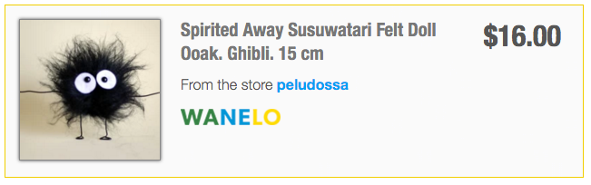
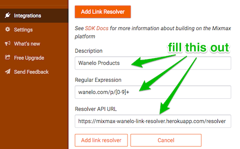

# Wanelo Link Preview for Mixmax

[](https://travis-ci.org/kigster/wanelo-mixmax-link-resolver)

This is a home page for the open source Mixmax Wanelo Product Link Resolver.



# Using It

To install the link resolver for your account, follow these instructions:

 1. Open up [MixMax Integrations](https://app.mixmax.com/dashboard/integrations).
    * You can also get to this page by first clicking on 'Mixmax' in your Gmail sidebar, and then choosing "Integrations" in the left navigation.
 2. Once you are on the integrations page, scroll all the way down to the bottom.
 3. Click on the button that says __Add Link Resolver__.
 4. Fill out the form as follows:
    * Description: `Wanelo Products`
    * Regular Expression: `wanelo.com/p/[0-9]+`
    * Resolver API URL: `https://mixmax-wanelo-link-resolver.herokuapp.com/resolver`
 5. Click the __Add link resolver__ button.



You should now be able to compose a new email, and paste any Wanelo Product URL, and see a fine preview of Wanelo product.

### Limitations

 * This will only work for wanelo products. User profiles, store profiles, etc. are not currently supported.
 * MixMax will display a small preview for products even without this link resolver, because Wanelo product pages conform to the Open Graph. However, they are far from perfect, and show only limited information.
 * You will need to add this resolver to each Gmail Account separately.

# Developing It

See <http://sdk.mixmax.com/docs/tutorial-giphy-link-preview> for more information about how to create link resolvers.

## Running locally

1. Install using `npm install`
2. Run using `npm start`

To simulate locally how Mixmax calls the resolver URL (to return HTML that goes into the email), pick any Wanelo
product URL, and run it as below:

```
curl http://localhost:9146/resolver?url=https://wanelo.com/p/38126141
```

## To run Mocha tests;

```bash
npm test
```

## Contributing

Bug reports and pull requests are welcome on GitHub at [https://github.com/kigster/wanelo-mixmax-link-resolver/issues](https://github.com/kigster/wanelo-mixmax-link-resolver/issues).

## Author

<p>&copy; 2016 Konstantin Gredeskoul, all rights reserved.</p>

Forked originally from the MixMax tutorial provided by

<p>&copy; 2015 MixMax, Inc. </p>

## License

This project is distributed under the [MIT License](https://raw.githubusercontent.com/kigster/wanelo-mixmax-link-resolver/master/LICENSE).

